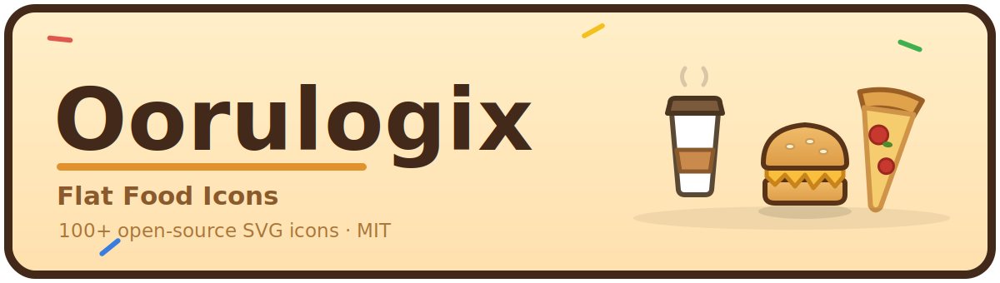
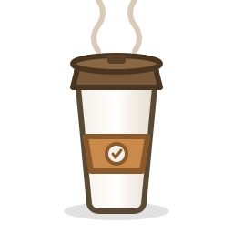

<p align="center"></p>

# 🍱 Flat Food Icons

An open-source pack of **372 original flat-cartoon icons** — food items **and** restaurant POS / management UI — for food-ordering apps, cooking games, dashboards, kiosks, and prototypes. Hand-built SVG — scalable, tiny, and easy to animate.

All artwork is original and all names are generic. Licensed under the **MIT License** (see `LICENSE`).

## Contents
- **Bakery** — 27 icons
- **Burger** — 21 icons
- **Coffee** — 57 icons
- **Freezer** — 37 icons
- **Orbean** — 35 icons
- **Pizza** — 13 icons
- **Pos** — 40 icons
- **Sandwich** — 70 icons
- **Seasonal** — 72 icons

## Structure
```
food-assets/
├── coffee/      cups, espresso, milk, syrups, ice, powders, creams, toppings, pastry-shells, drinks
├── sandwich/    breads, cheeses, toppings, sauces, fries, fry-toppings, grilled
├── pizza/       base, toppings
├── burger/      base, toppings, sauces
├── bakery/      crusts, fillings, top-crusts, toppers
├── pos/         payment, orders, restaurant, actions, dashboard  (POS / management UI icons)
├── catalog.json   machine-readable index (id, label, path) of every asset
├── CATALOG.md      human-readable catalog
├── gallery.html    open in a browser to see every icon labelled
├── build-catalog.js  regenerates catalog.json / CATALOG.md / gallery.html / README.md
├── LICENSE         MIT
└── README.md
```

## Usage
```html

```
Inline the SVG to animate inner groups — e.g. drink cups expose `<g id="steam">` for a rising-steam loop. Every icon shares the same `viewBox="0 0 256 256"`, a soft contact shadow, a dark cartoon outline, and flat cel-shading, so they mix cleanly.

After adding or renaming files, run `node build-catalog.js` to refresh the catalog and gallery.

## Credits
Original artwork — no third-party assets included. Released under the MIT License (see `LICENSE`).
